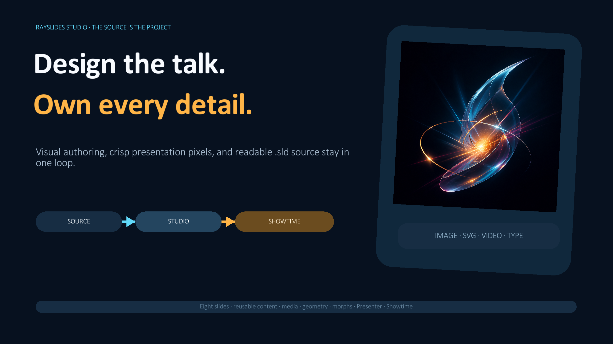
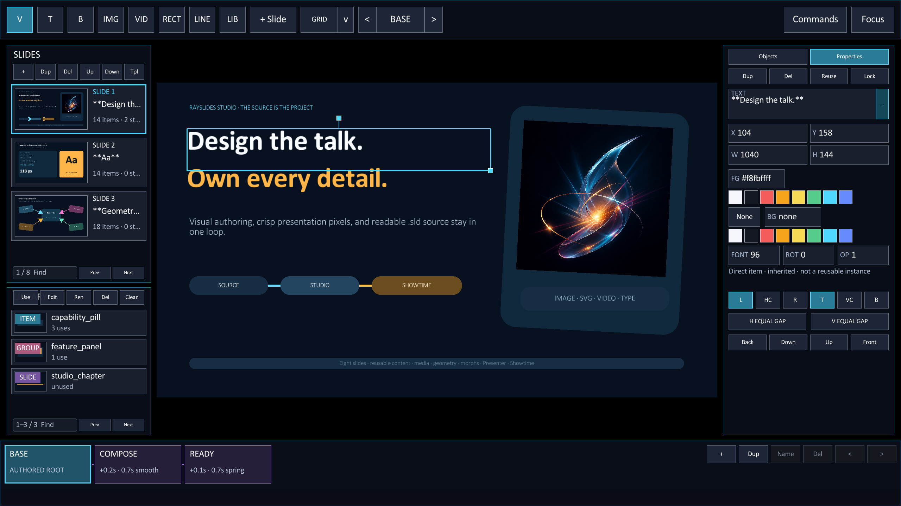
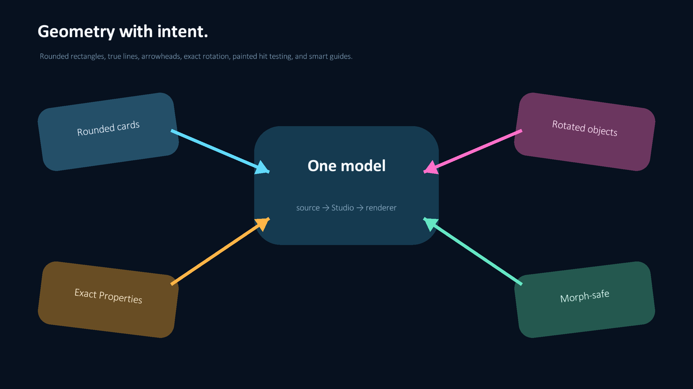
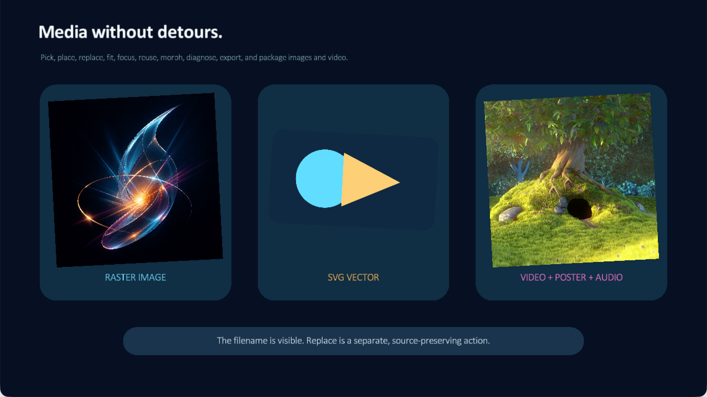

# Rayslides

Design visually. Keep readable source. Present without the cloud.

[](https://technologylab-ai.github.io/rayslides/)

Rayslides is a visual slide editor and presenter built with Zig and
[raylib](https://github.com/raysan5/raylib). Edit a deck on the canvas or in its
plain-text `.sld` source. Both views stay in sync.

[](https://technologylab-ai.github.io/rayslides/studio.html)

<p align="center">
  
  
</p>

With Rayslides, you can:

- edit slides directly and reuse items;
- author raster/SVG images, videos, rounded shapes, lines, arrows, aligned
  text, and rotated objects through source-backed Studio controls;
- add reveals, transitions, and semantic morph states;
- read private notes and control a deck from a phone;
- run Crowdplay polls on the local network;
- preflight the exact deck and create a verified portable show folder;
- save PNG screenshots and export a PDF; and
- build native programs for macOS, Linux, and Windows.

## Get started

Rayslides requires Zig 0.16.x. The minimum version is Zig 0.16.0.

```sh
zig build -Doptimize=ReleaseSafe
zig-out/bin/rayslides
```

Run the program without a file to open Studio's new-deck chooser. Use
`--studio` to edit an existing deck:

```sh
zig-out/bin/rayslides --studio talk.sld
```

Before travel, run Showtime from Studio's Commands menu, write a CI-friendly
report, or create a portable copy with ordinary source and assets:

```sh
zig-out/bin/rayslides --showtime-report=showtime.json talk.sld
zig-out/bin/rayslides --portable-show=talk-portable talk.sld
```

Blockers make either command exit nonzero. The portable command refuses an
existing destination, rewrites copied asset references under `assets/`, then
re-opens and preflights the copy before it succeeds.

During development, use `zig build run -- talk.sld`. On macOS,
`zig build -Doptimize=ReleaseSafe macos-app` also creates
`zig-out/Rayslides.app`.

Live camera items use the video renderer and therefore support fitting,
cropping, rotation, opacity, morphs, posters, and the existing playback pill:

```text
@box cam=0 video_size=1920x1080 poster_image=assets/camera-off.png x=520 y=180 w=880 h=560 fit=cover rotation=-12
```

On macOS, run camera decks from the bundled `Rayslides.app` so the system can
request camera permission. On Linux, use the intended V4L2 path such as
`cam=/dev/video0` or preferably its stable `/dev/v4l/by-id/...` symlink.

## Documentation

- [Read the online documentation](https://technologylab-ai.github.io/rayslides/)
- [Create your first deck](https://technologylab-ai.github.io/rayslides/getting-started.html)
- [Learn the Studio interface](https://technologylab-ai.github.io/rayslides/studio.html)
- [Add reveals, transitions, and morph states](https://technologylab-ai.github.io/rayslides/motion.html)
- [Use Presenter Companion](https://technologylab-ai.github.io/rayslides/presenter.html)
- [Run a Crowdplay poll](https://technologylab-ai.github.io/rayslides/crowdplay.html)
- [Write `.sld` source](https://technologylab-ai.github.io/rayslides/format.html)
- [Browse controls and limits](https://technologylab-ai.github.io/rayslides/reference.html)

## Project status

- [Read the unreleased four-topic release notes](RELEASE_NOTES.md)
- [Follow the active product roadmap](ROADMAP.md)

Rayslides began as a raylib-based port of
[renerocksai/slides](https://github.com/renerocksai/slides). It now combines
visual editing with its text-based foundation.
