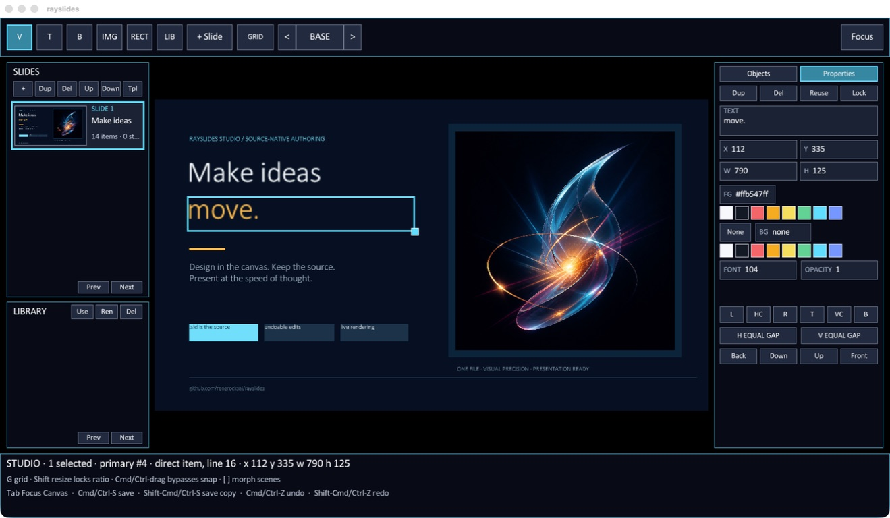
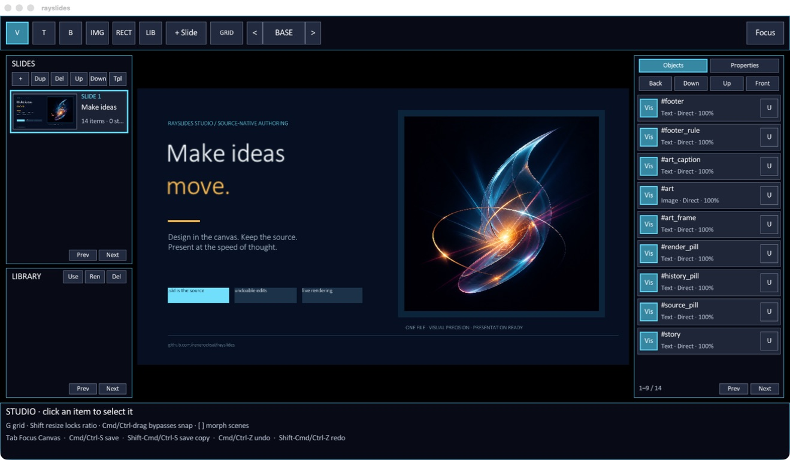
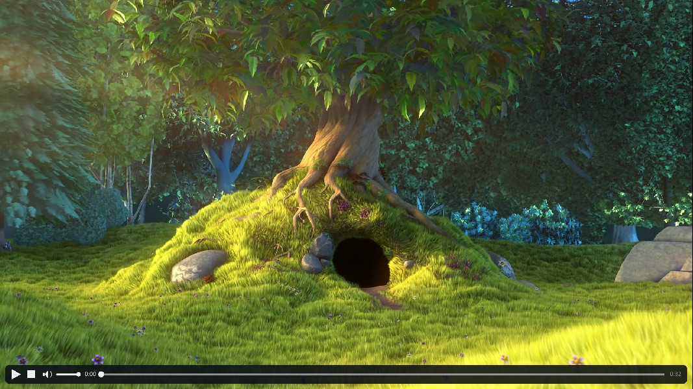

# Rayslides reference

Rayslides is a visual, source-native presentation studio built with Zig and
[raylib](https://github.com/raysan5/raylib). It began as a port of
[slides](https://github.com/renerocksai/slides) and now combines visual
authoring, presentation, audience participation, and export around readable
`.sld` files. Builds target macOS, Linux, and Windows.





## Build and run

Rayslides remains a command-line application on macOS, Linux, and Windows. The
ordinary build installs the executable at `zig-out/bin/rayslides`:

```sh
zig build -Doptimize=ReleaseSafe
zig-out/bin/rayslides talk.sld
```

During development, the equivalent run step is:

```sh
zig build run -- talk.sld
```

Run `rayslides --help` for the complete option list or `rayslides --version`
for the version. A positional `.sld` path works before or after options; use
`--` before a filename that itself begins with a hyphen.

Run the same exact parser/renderer readiness pass used by Studio without
opening a visible window:

```sh
rayslides --showtime-report=showtime.json talk.sld
rayslides --portable-show=talk-portable talk.sld
```

`--showtime-report` writes stable JSON and exits nonzero when blockers exist,
including malformed source. `--portable-show` refuses an existing directory,
copies the deck to an ordinary `.sld`, copies every literal image, video, and
custom-font dependency beneath `assets/`, resolves basename collisions with a
stable suffix, and rewrites only those copied references. Rayslides then opens
the copied deck through an independent parser, font set, and renderer and
writes `showtime-report.json` inside the folder. The original document,
history, selection, playback, and dirty state remain untouched.

On macOS, an additional build step creates a self-contained application bundle
without replacing or changing the CLI executable:

```sh
zig build -Doptimize=ReleaseSafe macos-app
open zig-out/Rayslides.app
```

The bundle is written to `zig-out/Rayslides.app`. It uses the Studio showcase's
light-sculpture artwork as its icon and registers Rayslides `.sld` documents,
so decks can be opened with Finder, **Open With → Rayslides**, or by dropping a
`.sld` onto the live window. It has only the local ad-hoc seal required for a
structurally valid Apple Silicon app—no signing identity, certificate,
Developer ID, account, or notarization. After copying it to another Mac, macOS
may require one right-click **Open** before ordinary double-click launches are
allowed. See the [macOS app notes](MACOS_APP.md) for file opening and
recovery locations.

Rayslides now includes a phone-first Presenter Companion: source-native private
speaker notes, explicit QR pairing, synchronized current and next-slide notes,
animation-aware Previous/Next controls, a software pointer, and remote drawing
over a live preview of the rendered slide. The accepted workflow and remaining
guardrails are recorded in the
[Presenter Companion roadmap](../PRESENTER_COMPANION_ROADMAP.md).

Missing but probably not coming soon:

- PPTX Export

## Presentation and Slide Navigation

See the next section for keyboard shortcuts for slideshow control and slide navigation. In addition to using the keyboard, you can also use a "clicker" / "presenter" device.

## Keyboard Shortcuts

| Shortcut | Description |
| -------- | ----------- |
| <kbd>Q</kbd> | Quit |
| <kbd>ESC</kbd> | Quit |
| <kbd>S</kbd> | Screen-Shot current slide  to PNG |
| <kbd>SHIFT</kbd> + <kbd>S</kbd> | Screen-Shot and export slideshow to PDF |
| <kbd>F</kbd> | Toggle fullscreen |
| <kbd>D</kbd> | Identify and choose the presentation display |
| <kbd>L</kbd> | Toggle laserpointer |
| <kbd>SHIFT</kbd> + <kbd>L</kbd> | Iterate laserpointer sizes |
| <kbd>C</kbd> | Clear laserpointer drawing |
| <kbd>B</kbd> | Toggle Beast Mode* |
| <kbd><-</kbd> | Hide the previous animation step or goto the previous slide |
| <kbd>PgUp</kbd> | Hide the previous animation step or goto the previous slide |
| <kbd>Backspace</kbd> | Hide the previous animation step or goto the previous slide |
| <kbd>-></kbd> | Reveal the next animation step or goto the next slide |
| <kbd>PgDown</kbd> | Reveal the next animation step or goto the next slide |
| <kbd>Space</kbd> | Reveal the next animation step or goto the next slide |
| Left click | Reveal the next animation step or goto the next slide |
| <kbd>1</kbd> | Goto first slide |
| <kbd>0</kbd> | Goto last slide |
| <kbd>G</kbd> | Goto first slide |
| <kbd>Shift</kbd> + <kbd>G</kbd> | Goto last slide |
| <kbd>M</kbd> | Play or pause videos on the current slide |
| <kbd>Shift</kbd> + <kbd>M</kbd> | Stop videos on the current slide (rewind to poster frame) |
| <kbd>O</kbd> | Open or lock the active Crowdplay poll |
| <kbd>V</kbd> | Reveal or hide Crowdplay results |
| <kbd>R</kbd> | Reset votes in the active Crowdplay poll |
| <kbd>P</kbd> | Show or hide private Presenter Companion pairing |
| <kbd>Shift-P</kbd> | Unpair the phone and stop the Presenter server |
| <kbd>E</kbd> | Enter or leave Studio visual editing mode |
| <kbd>F3</kbd> | Toggle frame/rebuild diagnostics |

**Beast Mode**: removes the 60 FPS limit

## Studio visual editing

The current direction and upcoming implementation tranches are tracked in the
[Studio roadmap](../STUDIO_ROADMAP.md).

Run rayslides without a slide file to open the **Create your first deck**
chooser in Studio. Choose Blank, Midnight, Editorial, or Aurora with a click
or keys <kbd>1</kbd>–<kbd>4</kbd>. Blank starts with one clean slide; the three
designed starters create two immediately useful slides plus source-native
`@pushslide` layouts, a reusable `@pushgroup` footer, stable item IDs, and live
`$slide_number` fields. Nothing is hidden in a project format: the result is
ordinary readable `.sld` source and one Undo returns to the pristine chooser.

Press <kbd>Cmd/Ctrl-S</kbd> on an untitled deck to choose its path. Rayslides
adds `.sld` when needed and refuses to overwrite an existing file. After the
deck has a name, the same shortcut atomically saves it and
<kbd>Shift-Cmd/Ctrl-S</kbd> writes a unique `*.edited.sld` copy. Pass `--studio`
with a slide file to open that deck directly in Studio, or press <kbd>E</kbd>
while presenting an existing deck. Studio is a visual authoring surface backed
by the ordinary `.sld` source: every completed action rewrites and reparses the
document, so the GUI and text formats remain two views of the same file.

Studio opens in a monitor-aware editing window (up to 1600×900) and fits the
16:9 slide into the space left by its chrome, so permanent controls never cover
slide content. Wide windows show the Slides/Library and Properties docks
together; narrower windows reserve one dock at a time through the toolbar
toggles. Press <kbd>Tab</kbd> for **Focus Canvas**, which hides all chrome while
leaving selection, guides, and direct manipulation active. Studio uses an
embedded, compact UI typeface independently of any fonts chosen by the deck.
When the window is enlarged beyond the 1600×900 reference surface, the whole
authoring shell scales coherently up to 2×—type, docks, timeline cards, object
rows, buttons, and hit targets—rather than enlarging labels inside fixed
panels. Retina framebuffer density is left to the platform so it is not counted
twice; the scaling follows the usable logical window size.

Click **Commands** or press <kbd>Cmd/Ctrl-K</kbd> to open Studio's contextual
command palette. Search by action, category, description, keyword, or shortcut;
use <kbd>Up</kbd>/<kbd>Down</kbd> and <kbd>Enter</kbd> to run an action. Commands
that are unsafe in the current slide, scene, selection, history, or clipboard
remain visible with the reason they are unavailable, so shortcut memorization
is optional rather than required. Studio also provides delayed hover help for
its tools, docks, Properties, layer controls, slide organizer, Library, and
morph timeline. The tooltips and pointer shapes disappear during gestures and
text entry, keeping the canvas calm while actively editing.

Press <kbd>Cmd/Ctrl-F</kbd> to search the panel under the pointer (or the active
dock): Slides, Library, or Objects. Search filters immediately without changing
the `.sld`, history, or dirty state. Use <kbd>Up</kbd>/<kbd>Down</kbd>,
<kbd>Home</kbd>/<kbd>End</kbd>, or the wheel to choose a result, then
<kbd>Enter</kbd> to jump to its slide, reusable definition, or object. While a
Find field is active, <kbd>Tab</kbd>/<kbd>Shift-Tab</kbd> cycles among all three
panels; each panel remembers its own query. <kbd>Esc</kbd> returns keyboard focus
to Studio while keeping the useful filter visible, and the pink × clears it.
Object filtering always retains full-slide Background rows because they are
real paint-order barriers, not cosmetic list entries. The command palette also
offers **Find a slide**, **Find a library entry**, and **Find an object**.

Studio's precision view is entirely editor-side: use **Commands** to toggle
calibrated rulers, 5% action-safe and 10% title-safe guides, or live dimensions
and edge distances for the current selection. <kbd>Cmd/Ctrl</kbd>-wheel zooms
around the pointer, plain wheel or trackpad input pans, and Space-drag or a
middle-button drag moves the canvas directly. <kbd>Cmd/Ctrl</kbd>-<kbd>0</kbd>
fits and recenters the complete slide. The view is constrained so the slide
cannot be lost offscreen, while presentation, screenshots, PDF export, source,
history, and saved files remain unaffected.

The right inspector opens on **Objects**, a front-to-back paint-order list for
the active base or morph scene. It includes hidden, fully transparent, and
locked objects so they remain recoverable when canvas hit-testing cannot reach
them. Click a row to select it, Shift-click for an ordered multi-selection,
use **Vis/Hid** and **L/U** for visibility and locking, and use the layer
buttons for atomic paint-order changes. Full-slide background rows remain
visible as read-only paint barriers. Switch to **Properties** in the same dock
for exact values and styling. Opacity accepts the inclusive range `0`–`1` or
`0%`–`100%`; visibility remains a separate source property.

Properties are edited inline without covering the canvas. Click a field, or
press <kbd>Enter</kbd> on a single selected text object while Properties is
visible. <kbd>Enter</kbd> commits, <kbd>Tab</kbd> and
<kbd>Shift-Tab</kbd> commit and traverse, <kbd>Shift-Enter</kbd> inserts a text
line, and <kbd>Esc</kbd> cancels the draft. Invalid values remain focused with
a field-local explanation; neither source nor history changes until validation
succeeds. Long and multiline values scroll with the caret. Multi-selection
shows truthful common/Mixed values. Compatible common fields commit as one
atomic source transaction; Studio refuses the complete edit when any selected
owner is unsafe or the field does not apply to every item.

For an image or video selection, the first Properties field identifies the
effective media kind and shows its source path. Click the separate
**Replace** button (or press <kbd>Enter</kbd> while Properties is visible) to
choose a replacement through the same native picker/manual-entry and
deck-relative path policy used for insertion. Replacement changes only
`img=` or `vid=`: geometry, opacity, ordering, IDs, and other authored
properties remain intact, and the edit is one ordinary Undo step. On a
reusable instance, an amber **R** beside a locally overridden source removes
only that `img=` or `vid=` override and restores the inherited asset.

Image and video selections share the same sizing controls. **Stretch** uses
the complete source to fill the authored box, **Fit** preserves its aspect
ratio inside the box, and **Fill** preserves its aspect ratio while cropping
enough to cover the box. `FX` and `FY` are normalized focal positions from `0`
(left/top) through `1` (right/bottom), with `0.5` centered. Properties also
shows the source's natural pixel dimensions beside the current box size.
Video Properties has a second **Playback** page. It exposes **Auto**, **Loop**,
and **Mute**, an exact poster-time field and duration-aware poster scrubber,
and authored volume and opacity fields. Choosing a poster changes the still
frame shown before playback, not the playback start position.
The same amber **R** marker identifies and resets local Fit, focal-position,
poster, volume, Auto, Loop, and Mute overrides without changing their shared
definition.

Text boxes expose horizontal `align=left|center|right` and vertical
`valign=top|middle|bottom` alignment. Color-only rectangles expose `radius=`
in logical pixels. Lines use `stroke_width=`, `direction=down|up`, and
`arrow=none|start|end|both`; drag either endpoint on the canvas, or use the
exact Properties fields. Press <kbd>L</kbd> for a plain line or <kbd>A</kbd>
for an arrow.

Eligible text, shape, image, video, and line objects expose `rotation=` in
clockwise degrees around the object's effective center. Drag the connected
handle above the selected object for direct rotation, and hold
<kbd>Shift</kbd> for 15° steps; use **ROT** in Properties for an exact value.
Hit testing, selection bounds, smart-guide targets, reusable/local ownership,
morphing, Showtime, screenshots, and PDF export all use the painted rotation.

If Studio cannot load an image or probe/decode a video, the missing media does
not become unselectable. Studio keeps a source-sized fallback box on the
canvas and leaves the filename and **Replace** action live in Properties.
Diagnostics distinguish a missing or unreadable file, unsupported image data,
missing ffmpeg/ffprobe, video probe or codec failure, and poster decode failure,
and prescribe the relevant repair. An out-of-range poster is clamped to the
last frame with an amber warning; a failed requested poster that can fall back
uses the first frame. Videos without an audio stream are identified without
being treated as broken. These repair overlays are authoring chrome and never
appear in presentation or export pixels.

SVG files use the same `img=` syntax, Image picker, sizing, Fit/Fill behavior,
replacement, reuse, diagnostics, and export path as raster images. Rayslides'
embedded NanoSVG subset renders vector shapes and paths deterministically but
does not implement SVG `<text>`; convert text to paths before presenting.

The top toolbar contains these one-shot canvas tools:

| Tool | Shortcut | Action |
| ---- | -------- | ------ |
| Select | <kbd>V</kbd> | Select, move, and resize an existing object |
| Text | <kbd>T</kbd> | Click, then enter text for a new text box |
| Bullets | <kbd>B</kbd> | Click, then enter one bullet per line |
| Image | <kbd>I</kbd> | Click, then browse for an image or enter its path |
| Video | <kbd>M</kbd> | Click, then browse for a video or enter its path |
| Rectangle | <kbd>R</kbd> | Click to add a colored shape |
| Line | <kbd>L</kbd> | Click to add a plain line; use <kbd>A</kbd> for an arrow |
| Library | <kbd>U</kbd> | Click, then name an existing reusable `@push` element |

On macOS, Image and Video prompts include a native **Browse…** picker rooted at
the saved deck's directory. Other platforms retain the portable path-entry
prompt. A chosen file is stored relative to a saved deck when possible;
untitled decks retain the selected path. While Studio is open, dropping a
supported image or video file over the canvas creates the corresponding media
item at the drop position through the same source/history transaction. Drop
one media file per gesture so each addition remains one visible Undo step.

Click an object and drag it to move it, drag the cyan handle at its
bottom-right corner to resize it, or drag the connected handle above it to
rotate it. The arrow keys nudge the selection by one
logical pixel; hold <kbd>Shift</kbd> to nudge by ten. Moves and resizes snap to
the slide and nearby object edges and centers, with magenta guides and a live
`x/y/w/h` readout. Hold <kbd>Cmd/Ctrl</kbd> during a drag to bypass snapping,
or press <kbd>G</kbd> to toggle the visible 20-pixel grid. Holding
<kbd>Shift</kbd> while resizing preserves the displayed aspect ratio, including
for auto-sized images; while rotating it snaps to 15° steps. The property panel
edits text, exact `x/y/w/h` values, font size, alignment, corner/stroke values,
rotation, opacity, foreground and item-background colors, duplicates or
deletes the object, promotes it for reuse, and aligns it to any slide edge or
center. Numeric width and height fields change only the chosen dimension, so
the other dimension of an auto-sized image remains automatic. Custom colors
accept `#RRGGBB` or `#RRGGBBAA`; opacity accepts `0`–`1` or `0%`–`100%`.
Fully transparent objects remain recoverable through the Objects inspector.
Shift-click toggles objects into an ordered
multi-selection, and <kbd>Cmd/Ctrl-A</kbd> selects every editable object in the
current scene. Drag an empty part of the canvas to marquee-select everything
the rectangle overlaps; hold <kbd>Shift</kbd> to toggle the marquee hits against
the selection that existed when the drag began. A group can be dragged or
nudged as one unit; the same alignment buttons align its members to the
selection bounds, while **H Gap** and **V Gap** distribute three or more
objects with equal spacing. Group moves, layer changes, duplication, and
deletion are each written atomically as one undoable source edit. Resize, text,
color, and promotion remain single-object operations; Studio refuses them for
a group instead of silently changing only its primary item. Batch duplicate or
delete is likewise refused as a whole when any selected object's source
ownership cannot be handled safely.
The **Layer** controls move one or several selected objects backward, forward,
to the back, or to the front while preserving the group's internal paint
order. A layer change is also one atomic source edit.
<kbd>Cmd/Ctrl-N</kbd> or **+ Slide** inserts a new slide immediately after the
current one. <kbd>Esc</kbd> cancels an active drag or tool, then leaves Studio.

<kbd>Cmd/Ctrl-C</kbd> copies selected authored objects to Studio's internal
clipboard; <kbd>Cmd/Ctrl-V</kbd> pastes fresh objects into the current base or
morph scene. Every pasted object receives a unique `id=`, is offset by 20
logical pixels on each successive paste, and the entire paste is one undoable
edit. Auto-sized images retain automatic sizing. The safe clipboard scope is
deliberately source-aware: copy accepts literal direct `@box` items and direct
`@pop` component instances in the base scene. A copied `@pop` remembers the
exact `@push` definition it resolved to, and paste is refused if the destination
would bind it to a shadowing definition. Component instances are base-scene
only, while ordinary boxes may be pasted into a morph scene. Generated items,
inherited slide-template objects, backgrounds, and Crowdplay panels are refused
without changing the source. Clipboard snippets remain source-faithful rather
than materializing inherited defaults, so pasting onto a slide with different
font or color defaults may intentionally adopt that destination's appearance.

**Lock** writes `locked=true` on selected objects. Locked objects remain in the
rendered deck but are excluded from normal clicking, select-all, snapping,
geometry, properties, and layer mutations. Click the visible **LOCK** badge to
select one for read-only copying; click it again, use **Unlock**, or press
<kbd>Cmd/Ctrl-L</kbd> to write `locked=false`. Locks follow the same ownership
rules as other properties, including instance-local and morph-state `@set`
overrides; hold <kbd>Alt</kbd> for an intentional shared-template lock change.
A locked object is also a layer barrier, so a batch move that would cross it is
refused atomically.

The Studio sidebar is a deck organizer and source-aware library. Its slide
cards contain live rendered thumbnails and can select, add, duplicate, delete,
or move complete slides while preserving their base content, morph states,
comments, and line endings. The library lists the effective `@push`,
`@pushgroup`, and `@pushslide` definitions available at the current source
position as cached visual cards. SLIDE cards use a 16:9 thumbnail; ITEM and
GROUP cards fit the definition's own content so a small component remains
recognizable. Cards reflow through compact, default, and large densities
without changing their hit targets. Selecting an available ITEM, GROUP, or
SLIDE shows a full, read-only, source-order-resolved preview on the canvas
without editing the deck; click the canvas or press <kbd>Esc</kbd> to return.
Choose **Use** to place the selected element or group at its authored size, or
to create the next slide from a selected template.
Choose **Edit**, double-click the row, or choose the right-side **Properties**
tab while a preview is open (the compact **Inspector** button is equivalent)
to open persistent Definition mode. The canvas, Objects, and Properties then
edit the exact shared ITEM, GROUP, or
SLIDE source, and the breadcrumb reports how many uses are affected. An ITEM
definition selects its single object and opens Properties immediately; GROUP
and SLIDE definitions open Objects so you can choose one or several members.
**Back**, <kbd>Esc</kbd>, another Library card, or slide navigation leaves
Definition mode and restores/navigates the authoring view. Edits are applied
to the in-memory source immediately and remain undoable; there is no separate
apply step, while <kbd>Cmd/Ctrl-S</kbd> persists the dirty deck to disk.
Literal GROUP blocks and direct
SLIDE templates also support the normal add, duplicate, delete, layer reorder,
copy, and paste actions. New GROUP members always receive stable literal IDs;
deleting a SLIDE member removes dependent local and morph mutations atomically.
Generated structures and GROUPs nested transitively inside slide templates are
refused with an explanation instead of being partially rewritten. ITEM
definitions remain one-object definitions, while geometry, text, colors, font
size, opacity, visibility, locking, and the complete image/video Properties
surface use the normal source-backed undo/redo path for every kind. A GROUP
member selected in an ordinary slide is generated by its `@popgroup` use, so
edit that shared member in Definition mode or choose **Detach**; in a morph
scene, its qualified ID can receive an unambiguous state-local override.
**Ren** changes that
definition and its source-order-resolved uses; **Del** removes only unused
ITEM or GROUP definitions. Slide-template deletion and definitions with live
uses are deliberately refused. Later or shadowed definitions are absent
because they would not resolve at that insertion point.

The organizer's **Tpl** action promotes an eligible direct slide into a named
`@pushslide` definition while leaving an equivalent `@popslide` instance in
its original deck position. Promotion is intentionally conservative: Studio
refuses template-backed slides or source whose global/default context cannot
be moved without changing semantics.

New text/bullet/image creation and reusable-name actions open a small modal
editor; editing an existing object's ordinary properties uses the inline
inspector described above.
<kbd>Enter</kbd> commits, <kbd>Shift-Enter</kbd> inserts a line in text fields,
<kbd>Cmd/Ctrl-V</kbd> pastes, and <kbd>Esc</kbd> cancels without touching the
source.

### Rendering diagnostics

Press <kbd>F3</kbd>, or launch with `--diagnostics`, to show frame time, the
one-second peak and slow-frame count, render-graph rebuild time and mode, the
number of slides rebuilt, full/partial/unchanged rebuild counters, slideshow
arena capacity, Studio preparation time, cache rebuild counts, Library gallery
projected/placeholder counts, deck size,
active item/render-fragment counts, mouse coordinates, and window size. A `*`
beside the cache counters marks a rebuild in the current frame. Slow frames
are also rate-limited in the log while diagnostics are active. In Studio the
HUD uses
the free toolbar span between the authoring controls and Commands/Focus, so it
does not cover slide content; narrow layouts hide it rather than crowding the
controls.
`--diagnostics-select=ID` opens Studio with the unique authored `id=` selected
in Properties; this is a non-mutating QA aid. Normal playback uses synchronized
presentation plus a 60 Hz fallback; Beast Mode intentionally disables both
limits.
`--diagnostics-command-palette` opens Studio with the command palette visible,
which makes compact/default/large screenshot regression checks deterministic.
`--diagnostics-command-tooltip` similarly holds the Commands hover card open
for deterministic typography and containment QA across macOS Spaces.
`--diagnostics-confirm-display=N` validates the one-based active-monitor number
and drives the real display picker identify/confirm functions before the QA
frame. Pair it with `--diagnostics-display-picker` to capture the selected and
current monitor labels, or with `--diagnostics-showtime` to preflight the exact
confirmed display. This is a diagnostics-only venue harness; ordinary users
still identify and confirm displays interactively.
`--diagnostics-presenter-session` starts Presenter with the private pairing
screen, then automatically hides setup and enters normal presentation after an
authenticated client begins polling. It is a browser-QA harness that exercises
the production server, queues, and renderer without logging the capability;
ordinary pairing remains explicitly controlled with <kbd>P</kbd>.
`--diagnostics-precision-view` enables rulers, both safe areas, measurements,
and a 110% canvas view for deterministic precision-surface QA; pair it with
`--diagnostics-select=ID` to measure a specific authored object.
`--diagnostics-large-deck=COUNT` creates an in-memory, parser-backed Studio
stress deck with reusable elements and morph states. `COUNT` accepts 1–200;
the deck is intentionally untitled and does not touch a file unless you
explicitly save it.
`--diagnostics-incremental-edit=N` performs one real, undoable Properties-style
source edit on the one-based slide `N` after the first complete frame. Pair it
with the large-deck flag to verify that the next HUD event is a selective
`partial 1/COUNT` rebuild without synthesizing keyboard or pointer input.
`--diagnostics-find-slide=QUERY` opens the real slide-picker Find field with a
deterministic query, and `--diagnostics-window=WIDTHxHEIGHT` requests an exact
Studio client size (minimum 900×506). Together they make compact/default/large
navigation screenshots reproducible without synthesizing global key input.
`--diagnostics-library-preview=NAME` selects the exact physical Library
definition and opens its isolated read-only canvas preview.
`--diagnostics-library-definition=NAME` opens that definition in the editable
Definition scene. The parser-clean `testslides/studio-library-qa.sld` fixture
contains representative ITEM, GROUP, and SLIDE definitions for deterministic
gallery/editor captures at default and minimum window sizes.
`--no-startup-banner` suppresses the four-second launch banner for unattended
captures, kiosk launches, and other cases that need the first frame to contain
only the deck and Studio chrome.

The repository includes an opt-in visual and performance baseline harness for
compact Properties, the default command palette, large precision mode, and a
real one-slide incremental rebuild in a synthetic 160-slide deck. On this Mac,
the following command moves each short-lived window to Aerospace workspace 12,
verifies that exact process window is both on workspace 12 and floating, then
releases an in-app capture gate:

```sh
zig build -Doptimize=ReleaseSafe studio-baselines -- --workspace 12
```

Use `studio-baselines-update` with the same arguments only after deliberately
reviewing a visual or performance change. Actual captures, amplified failure
diffs, reports, and logs are written below `zig-out/studio-baselines`; approved
PNG and JSON references live in `tests/studio_baselines`. The harness requires
Python Pillow. See [the baseline notes](../tests/studio_baselines/README.md) for
tolerances and individual-scenario commands.

For release work, `zig build release-confidence` runs the headless resilience
gate. The repeatable [macOS release checklist](MACOS_RELEASE_QA.md) adds
verified Aerospace placement, focus, multi-monitor/resize/fullscreen, reload,
Save As/recovery, and presentation/export checks.

Studio edits the `.sld` document rather than maintaining a separate opaque
scene. It changes only the source owned by the selected object and preserves
unrelated spacing, comments, text, and line endings. Objects instantiated with
`@pop` are edited at that instance. Named objects inherited from `@pushslide`
are also edited locally by default: Studio creates or updates an `@set` beside
the current `@popslide`, and Delete adds `@hide`. Hold <kbd>Alt</kbd> while
moving, resizing, nudging, or changing a property to edit the shared template
definition instead. This also works from an already-customized instance:
Studio retains the shared authored value layer and applies the gesture delta
there without baking the local coordinates into every slide. The current slide
keeps any properties it overrides. <kbd>Alt</kbd>-Delete removes the shared item
and its source-resolved local and morph mutations together; ambiguous or
generated dependency layouts are refused atomically. Template items use an
amber outline and the status bar states whether an operation is local or
shared. An inherited object without a unique `id=` cannot receive a local
override; add an ID or use <kbd>Alt</kbd> for an intentional shared edit. A
generated shared directive produced through `@let` remains read-only, but an
identified inherited item can still receive a later literal local override.
Background swatches write an item-owned `bg=` fill, so a local template
override stays behind its own text, image, or panel without creating a
z-order-sensitive sibling rectangle. Use the **None** background control to
write `bg=none` and clear an inherited or directly authored fill.

**Reuse** (or <kbd>P</kbd>) promotes a direct box to a named `@push` definition
and leaves an equivalent `@pop` instance in place. The Library tool creates
more instances later in the document. Reusable definitions are source-order
scoped, so a library item can only be placed after its definition.

| Studio shortcut | Description |
| --------------- | ----------- |
| <kbd>Cmd/Ctrl</kbd> + <kbd>K</kbd> | Open the searchable contextual command palette |
| <kbd>Cmd/Ctrl</kbd> + <kbd>F</kbd> | Find and jump within Slides, Library, or Objects |
| <kbd>1</kbd>–<kbd>4</kbd> on the new-deck chooser | Create Blank, Midnight, Editorial, or Aurora |
| <kbd>Cmd/Ctrl</kbd> + <kbd>S</kbd> | Name an untitled deck, then atomically save changes to its `.sld` file |
| <kbd>Shift</kbd> + <kbd>Cmd/Ctrl</kbd> + <kbd>S</kbd> | Name an untitled deck, or save an `*.edited.sld` copy of a named deck |
| <kbd>Cmd/Ctrl</kbd> + <kbd>Z</kbd> | Undo the last visual edit |
| <kbd>Shift</kbd> + <kbd>Cmd/Ctrl</kbd> + <kbd>Z</kbd> | Redo the last visual edit |
| <kbd>[</kbd> / <kbd>]</kbd> | Edit the base scene, previous morph state, or next morph state |
| <kbd>G</kbd> | Toggle grid display and grid snapping |
| <kbd>Cmd/Ctrl</kbd> + mouse wheel | Zoom the canvas around the pointer |
| Mouse wheel / trackpad scroll | Pan the canvas |
| Space + drag / middle-button drag | Pan the canvas directly |
| <kbd>Cmd/Ctrl</kbd> + <kbd>+</kbd> / <kbd>-</kbd> | Zoom in / out around the canvas center |
| <kbd>Cmd/Ctrl</kbd> + <kbd>0</kbd> | Fit and recenter the complete slide |
| <kbd>Tab</kbd> | Toggle Focus Canvas without leaving Studio |
| Hold <kbd>Shift</kbd> while resizing | Preserve the object's aspect ratio |
| Hold <kbd>Cmd/Ctrl</kbd> while dragging | Temporarily bypass smart guides and grid snapping |
| <kbd>Shift</kbd> + click | Add or remove an object from the current selection |
| Drag empty canvas | Marquee-select every overlapping object |
| <kbd>Shift</kbd> + drag empty canvas | Toggle marquee hits against the starting selection |
| <kbd>Cmd/Ctrl</kbd> + <kbd>A</kbd> | Select every editable object in the current scene |
| <kbd>Cmd/Ctrl</kbd> + <kbd>C</kbd> | Copy selected direct boxes or direct component instances |
| <kbd>Cmd/Ctrl</kbd> + <kbd>V</kbd> | Paste clipboard objects, offset by another 20 pixels |
| <kbd>Cmd/Ctrl</kbd> + <kbd>[</kbd> / <kbd>]</kbd> | Move the selection one layer down / up |
| <kbd>Shift</kbd> + <kbd>Cmd/Ctrl</kbd> + <kbd>[</kbd> / <kbd>]</kbd> | Move the selection to the back / front |
| <kbd>Cmd/Ctrl</kbd> + <kbd>L</kbd> | Lock or unlock the selected objects |
| <kbd>Backspace</kbd> | Atomically delete the selected object or selection |
| Hold <kbd>Alt</kbd> while editing a template item | Edit its shared definition instead of this instance |
| <kbd>Enter</kbd> | Edit the selected object's text |
| <kbd>P</kbd> | Promote the selected object for reuse |
| <kbd>Enter</kbd> | Use the selected library entry when no canvas object is selected |
| <kbd>F2</kbd> | Rename the selected library definition and its resolved uses |
| <kbd>Shift</kbd> + <kbd>Delete</kbd> | Delete the selected library definition when it is unused |
| <kbd>Cmd/Ctrl</kbd> + <kbd>N</kbd> | Insert a new slide after this slide |
| <kbd>Cmd/Ctrl</kbd> + <kbd>Shift</kbd> + <kbd>P</kbd> | Promote the current slide to a reusable slide template |
| <kbd>Page Up</kbd> / <kbd>Page Down</kbd> | Select the previous or next slide in Studio |
| <kbd>Cmd/Ctrl</kbd> + <kbd>D</kbd> | Atomically duplicate the selected object(s), or the current slide when none are selected |
| <kbd>Cmd/Ctrl</kbd> + <kbd>Backspace</kbd> | Delete the current slide (except the only slide) |
| <kbd>Alt</kbd> + <kbd>Shift</kbd> + <kbd>Up/Down</kbd> | Move the current slide when no object is selected; otherwise nudge the shared template item by ten |

The `*` beside `STUDIO` means the in-memory document differs from the original
file. Automatic file reload is paused while those unsaved changes exist.
Transitions are paused in Studio and ordinary reveal items are shown. The scene
control in the toolbar switches between the base scene and each semantic morph
state. The bottom timeline makes that cumulative structure explicit: BASE is
the authored root, followed by cards showing each state's label, automatic
delay, duration, and easing. Click a card to preview/edit it. The adjacent
controls add a state after the current scene, duplicate the current visual
snapshot, name, delete, or move a state earlier/later. Every structural action
is one source transaction and one Undo entry; unsafe dynamic/global ownership
or broken dependencies are refused without changing the document. BASE can
create the first state, but cannot itself be renamed, deleted, or reordered.

Editing an inherited, named item creates or updates a state-local `@set`;
deleting it creates `@hide`. Items born in the active state are edited at their
own directive. Background creation and reusable promotion remain base-scene
operations because they change structural layout rather than one morph state.
Structural edits are also undoable. Layer changes support literal direct boxes,
direct component instances, and objects born in the active morph state, but do
not reorder inherited slide-template content. Items separated by a mutation,
definition, global default, or another source-ownership boundary cannot cross
it. Full-slide `@bg` items are pinned layer boundaries, so **Back** cannot hide
ordinary content underneath the slide background. If a layout cannot be moved,
copied, or duplicated unambiguously, Studio refuses the whole operation and
leaves the source intact.

Object duplication is also source-aware: it copies each complete item body and
owned reveal animation, assigns fresh stable `id=` values, offsets the clones
by 20 logical pixels, and leaves auto-image sizing untouched. A mixed batch of
direct boxes and direct `@pop` component instances is committed as one edit.
Inherited morph items, local slide-template clones, generated directives, and
crowd panels are conservatively refused when they cannot be duplicated without
changing their ownership semantics. Hold <kbd>Alt</kbd> with **Dup** or
<kbd>Cmd/Ctrl-D</kbd> to duplicate an uncustomized item in the shared slide
template.

If the original file changes externally, Studio refuses to overwrite it and
asks you to use Save Copy. Quitting with unsaved work also writes a unique
`*.edited.sld` recovery copy before closing; if that copy cannot be written,
the quit is cancelled. A named deck first recovers beside its source. The
macOS app falls back—and stores untitled recovery copies—in
`~/Library/Application Support/Rayslides/Recovery`; it does not use Documents
or request Documents-folder access. Direct CLI launches retain the traditional
behavior of recovering an untitled deck into their current working directory.

# Slideshow Text Format

## Markdown Format

Bulleted items can be placed and nested like this:

```markdown
- first
    - second (4 space indendation)
        - third ...
```

Formatting is supported:

```markdown
Normal text.
**Bold** text.
_italic_ text.
_**Bold italic**_ text.
~~Underlined~~ text.
`rendered with "font_extra" (e.g. "zig showtime" font)`
<#rrggbbaa>Colored with alpha</> text. E.g. <#ff0000ff>red full opacity</>
```

Inline code uses an optical size correction derived from the active body and
`font_extra` glyph metrics. A blocky display face therefore stays distinctive
without overpowering adjacent prose. Its baseline is aligned from the same
metrics, and measurement, wrapping, shadows, rendering, and morphing all use
the corrected geometry. At a mixed-font boundary, whitespace uses the wider
space advance of its two neighbors, so neither body-to-code nor code-to-body
spacing becomes cramped.

### Symbols and emoji

Rayslides includes portable monochrome fallbacks for common presentation
symbols, even when a selected custom font does not contain them. They inherit
the surrounding text color, opacity, shadow, and animation.

The curated set includes directional arrows (`← ↑ → ↓ ↔ ↖ ↗ ↘ ↙`), media
controls (`▶ ◀ ⏩ ⏪ ⏸ ⏹ ⏺`), status marks (`✅ ✔ ❌ ⚠ ℹ ❓ ❗`), and useful
visual accents such as `✨ ⭐ ❤ 🎉 🎯 🏆 👍 👀 👏 💡 📈 📉 📌 🔥 🚀 🛠 🤖 🧠`.
Emoji variation selectors are accepted and ignored safely. Complex joined
emoji sequences are rendered as their supported individual glyphs rather than
as a single color ligature.

### Text shadows

Text boxes can draw a solid drop shadow without duplicating and offsetting the
same text manually. Set its color with `shadow=`; the default offset is four
pixels down and right:

```text
@push slide_title x=110 y=71 w=1712 h=100 fontsize=52 color=#eeeeeeff shadow=#000000a0

@pop slide_title text=A title with a drop shadow
```

Use `shadow_offset=` to set both coordinates, or `shadow_x=` and `shadow_y=`
for different offsets. Negative offsets are allowed. Shadow attributes inherit
through `@push`/`@pop`, and an inherited shadow can be disabled with
`shadow=none`:

```text
@box x=100 y=100 w=1700 h=200 fontsize=96 color=#f7a41dff shadow=#000000ff shadow_x=3 shadow_y=5 text=Shadowed text

@pop slide_title shadow=none text=No shadow on this instance
```

The shadow uses the same font, wrapping, markdown spans, reveal state, opacity,
and motion as its text. It is deliberately a crisp duplicate-text shadow, not
a blurred raster effect. As with other box attributes, place shadow attributes
before `text=` on an inline `@box` or `@pop` directive.

## Showtime: preflight the exact show

Open Studio's command palette and choose **Showtime preflight**. The overlay
audits every base scene, reveal endpoint, cumulative morph scene, reusable
ITEM/GROUP/SLIDE definition, and the deterministic poster-frame render graph
used by previews, screenshots, and PDF export. It does not navigate, seek,
play media, edit source, change selection/history, or touch Crowdplay state.

Showtime treats missing or undecodable presentation pixels, malformed source,
missing runtime glyphs, and required unavailable services as blockers. It uses
warnings for conditions that may be deliberate but deserve review, including
overflow, off-canvas staging, absolute or parent-escaping asset paths,
non-16:9/low-refresh displays, and an untested Presenter connection. Each
render finding carries a slide, object, morph state, reusable definition, or
source line when that identity exists. Select a finding and press
<kbd>Enter</kbd> to open its slide/object or editable Library definition.

The selected presentation display is the one previously confirmed with
<kbd>D</kbd>. Showtime checks its resolution, aspect ratio, refresh, and vsync;
Rayslides letterboxes without stretching. Presenter and Crowdplay listeners
must bind before they are reported ready. The private companion periodically
uploads only its bounded latency counts, median/p95 values, and failures to the
local Presenter server. No notes, URL, capability, session identity, or client
identity enters the Showtime report. Exercise navigation, Pointer, and Draw on
the intended venue network so the report has representative evidence.

Overlay controls are <kbd>↑</kbd>/<kbd>↓</kbd> or the mouse wheel to review,
<kbd>Enter</kbd> to open the selected source target, <kbd>R</kbd> to rerun,
<kbd>P</kbd> to create a portable folder, and <kbd>Esc</kbd> to close. Warnings
do not prevent **Ready for show**; blockers do.

**Create portable show** is also available directly from Commands. Rayslides
copies literal `img=`, `vid=`, and custom `@font*` dependencies—including
unused reusable definitions—into `assets/`, handles equal basenames
deterministically, writes an ordinary readable `.sld`, then independently
re-opens and preflights that copy. The destination must not already exist, so
no folder is silently merged or overwritten.

## Presenter Companion: private notes and phone control

Speaker notes are ordinary per-slide `.sld` source. They do not become slide
items and are deliberately excluded from renderer fingerprints, screenshots,
PDF export, and Crowdplay state:

```text
@slide
@box text=The projected slide remains public
@notes
Open with the customer story.
Pause here, then ask the room a question.
@endnotes
```

Only an unindented `@endnotes` line terminates the block (trailing whitespace
is ignored), so notes may contain `@handles`, example directives, Markdown, and
code. In Studio, open **Commands**, then choose **Edit speaker notes** for the
current slide. The multiline edit is transactional and participates normally
in save, copy, undo, redo, reload, and recovery.

To present with a phone:

1. If desired, enable the phone's hotspot and join it from the laptop first.
2. Press <kbd>P</kbd>, or choose **Pair presenter phone** in Studio.
3. Check the detected interface and reachability note beneath the QR. Rayslides
   prefers a physical private LAN over public, VPN, link-local, and loopback
   addresses. Press <kbd>N</kbd> to choose another active address when the phone
   is on a different interface.
4. Scan the private QR code. The embedded companion needs no installation,
   account, Internet access, or externally hosted assets.
5. Press <kbd>P</kbd> again to hide setup, enable display mirroring, and put
   rayslides fullscreen. The phone shows current/next notes, talk time,
   connection status, and large Previous/Next controls.
6. Switch between **Notes**, **Pointer**, and **Draw** on the phone. Pointer and
   Draw keep a compact copy of the current speaker notes below their controls, so
   you can glance at the script without leaving the active tool. Pointer shows
   a compact preview of the current rendered slide; touch and hold anywhere on
   it, drag the software laser, and lift to hide it. Draw mirrors normalized
   strokes onto the projected slide and provides a deliberate **Clear drawing**
   button. Rotate the phone to landscape for a larger control surface. On short
   landscape screens, Pointer and Draw intentionally collapse the header,
   instructions, and compact notes so the complete 16:9 surface and Clear
   action remain above the fixed navigation bar; switching back to Notes
   restores the full notes layout.
7. Press <kbd>Shift-P</kbd> to invalidate the pairing capability and stop the
   Presenter server. Simply hiding setup leaves the paired phone connected.

For an extended-display laptop workflow, show pairing and press <kbd>L</kbd>.
Rayslides copies the complete private link without printing or logging its
capability. Paste it into a browser on the presenter laptop, then hide pairing.
At viewport sizes of at least 900×600 pixels the same self-contained companion
deliberately uses a laptop layout. Requiring laptop-like height keeps large
phones in the phone layout when rotated to landscape. Current and next notes
sit side by side, Pointer and Draw keep the slide surface beside the notes, and
<kbd>←</kbd>/<kbd>→</kbd>,
<kbd>Page Up</kbd>/<kbd>Page Down</kbd>, or <kbd>Space</kbd> navigate. Number
keys <kbd>1</kbd>, <kbd>2</kbd>, and <kbd>3</kbd> select Notes, Pointer, and Draw.
The link remains a private bearer capability; do not paste it into chat or a
shared browser profile.

Open **Connection health** at the bottom of the companion when rehearsing on a
real venue network. It retains the newest 80 browser-to-laptop samples for state
polling, commands, pointer updates, and drawing updates, and reports median,
p95, sample count, and failures for each. The report contains no notes, pairing
link, capability, or session identity. Measure after the phone has settled on
the actual Wi-Fi or hotspot; the pointer/drawing numbers cover authenticated
delivery to the laptop, while a camera or observer is still required to judge
phone-to-projector pixels. While the pairing remains current, the browser also
sends just those bounded numeric summaries back to the local Presenter server
so Showtime can distinguish a merely running listener from a measured venue
rehearsal. Re-pairing or stopping Presenter clears the retained summary.

Opening a fresh QR in an existing Presenter tab is supported. The client
detects the new capability fragment, reloads itself, and replaces the expired
session instead of continuing to poll with the previous capability.

Press <kbd>D</kbd> before going fullscreen to open **Choose presentation
display**. The same action is available from Studio’s Commands menu. Rayslides
lists every active monitor by its operating-system name, resolution, refresh
rate, and desktop coordinates, while separately marking the saved selection and
the screen that currently holds the window. It never labels an external screen
“projector” on your behalf. Use <kbd>↑</kbd>/<kbd>↓</kbd> to select a row and
<kbd>Space</kbd> to move the window there with a large identification label;
press <kbd>Enter</kbd> to keep it or <kbd>Esc</kbd> to return to the previously
confirmed display. Clicking a row identifies it; clicking the identified row a
second time confirms it. If the picker was opened from fullscreen, confirm or
cancel restores the same borderless or exclusive fullscreen mode on the chosen
or previous display. A disconnected choice is clamped to an active display,
and the window is aspect-preservingly reduced if it would not fit.

Phone navigation enters the same main-thread playback functions as keyboard,
mouse, and clicker input, preserving reveal animations, reversal, transitions,
and auto-reveal behavior. A lost phone or failed network never prevents local
presentation control. Pointer motion is normalized to the fitted slide rather
than the window, coalesced to the newest value, and expires after 900 ms without
a heartbeat. Leaving Pointer, backgrounding the browser, or lifting the finger
also sends an immediate release. The laptop's local laser/drawing tool takes
precedence and temporarily pauses the phone pointer without disabling phone
navigation. Draw strokes appear immediately in a phone-side canvas without
requesting new slide images, use a bounded authenticated event queue on the
laptop, and time out safely if touch-end is lost. They persist through reveals
on the current slide and clear automatically when the logical slide changes;
the phone button or local <kbd>C</kbd> clears both local and remote annotations.

Presenter Companion and Crowdplay intentionally run as two independent local
servers. Crowdplay retains port `7331` and its audience-only API; Presenter is
started only by explicit pairing on port `7332`, with a random capability kept
in the QR URL fragment. Notes, rendered previews, navigation, pointer updates,
and drawing events exist only on the authenticated Presenter server and are
absent from Crowdplay. Use `--presenter-host=HOST` to advertise a specific LAN
address and `--presenter-port=PORT` to change its port. Use an explicit override
when native adapter discovery cannot see an intended policy-managed network.
While Presenter is running, Rayslides checks active
interfaces every 1.5 seconds. Switching from venue Wi-Fi to a phone hotspot
rotates the session ID and private capability, invalidates the obsolete phone
session, and prepares a fresh QR on the new address without changing the server
port. Local HTTP and an unguessable capability prevent accidental audience
access but do not defend against a malicious observer on an untrusted network.

## Crowdplay: live audience participation

Crowdplay turns audience phones into live inputs without an app, account, or
cloud service. A deck containing `@crowd` starts a small LAN server, embeds a
self-contained phone client, and renders participants as an animated swarm.
Votes are unique per browser, retry-safe, and may be changed while a poll is
open.

Start with a join slide. rayslides displays a scannable QR code, the local URL,
and the live participant count:

```text
@bg color=#070b18ff
@crowd join x=100 y=80 w=1720 h=920
Scan to join the room
```

Add a poll with a stable `id=`. The first body line is the question and each
`- ` line is a choice:

```text
@bg color=#070b18ff
@crowd poll id=architecture open=true x=100 y=80 w=1720 h=920
What should we build next?
- A tiny compiler
- A moon base
- Both, obviously
```

Use <kbd>O</kbd> to open/lock voting, <kbd>V</kbd> to reveal the animated
distribution, and <kbd>R</kbd> to reset the poll. Revealing and locking are
independent, so you can show results while votes continue to arrive. Crowdplay items participate
in normal z-order, item animations, and slide transitions. A poll supports up
to eight choices; a deck supports up to 32 polls and 512 active participants.
Use one Crowdplay item per slide and unique poll IDs containing only letters,
digits, `-`, or `_`. IDs are limited to 48 bytes, prompts to 192 bytes, and
choice labels to 64 bytes. Omitted panel geometry defaults to
`x=100 y=80 w=1720 h=920`.

A Crowdplay `id=` is also a semantic-morph target. Declare the Crowdplay item
before the first `@state(morph)` and use `@set`, `@show`, or `@hide` to move,
resize, or fade the live panel while keeping its audience state intact.

The default audience address is `http://<computer-name>.local:7331/`. Override
the advertised hostname or port when mDNS is unavailable:

```sh
zig build run -- testslides/crowdplay.sld --crowd-host=192.168.1.42 --crowd-port=7331
```

Use `--no-crowd` to disable the server. Phones and the presenting computer must
be on the same network, and the local firewall must permit the selected port.
On Windows, pass `--crowd-host=<LAN-IP>`; `localhost` is only reachable from the
presenting computer itself.
The transport is deliberately ordinary HTTP with revision polling for maximum
phone/browser compatibility; the state and voting protocol remains suitable
for a future WebSocket transport.

## Slideshow Format

Internal render buffer resolution is 1920x1080. So always use coordinates in this range.

More documentation to follow.

## Videos

Videos are placed like images, with the `vid=` attribute instead of `img=`:

```text
# explicit size:
@box vid=assets/demo.mp4 x=320 y=200 w=1280 h=720

# only width; height follows the video's aspect ratio:
@box vid=assets/demo.mp4 x=320 y=200 w=1280

# natural size, with the same scale=/ratio= adjustments images support:
@box vid=assets/demo.mp4 x=320 y=200 scale=0.5

# start playing when the slide is entered; restart when the video ends:
@box vid=assets/demo.mp4 x=320 y=200 w=1280 autoplay loop

# show the frame at 6.2 seconds as the still before playback:
@box vid=assets/demo.mp4 x=320 y=200 w=1280 poster=6.2

# author the audio defaults used whenever the slide is entered:
@box vid=assets/demo.mp4 x=320 y=200 w=1280 volume=0.65 muted
```

## Image and video fitting

Images and videos use identical box-fitting syntax. The backward-compatible
default is `fit=stretch`; `contain` corresponds to Studio's **Fit** control and
`cover` corresponds to **Fill**:

```text
# preserve the complete image and center any letterboxing:
@box img=assets/portrait.png x=120 y=180 w=760 h=520 fit=contain

# fill the video box, cropping around a point toward the right and bottom:
@box vid=assets/demo.mp4 x=1040 y=180 w=760 h=520 fit=cover focus_x=0.75 focus_y=0.8
```

`focus_x=` and `focus_y=` accept normalized values from `0` through `1` and
default to `0.5`. With `cover`, they select the retained crop; with `contain`,
they position the fitted picture in any spare space. When neither dimension is
authored the natural size is retained, and when only one dimension is authored
the other follows the natural aspect ratio. Hold <kbd>Shift</kbd> during a
Studio resize to preserve the current displayed aspect ratio.

Decoding is delegated to [ffmpeg](https://ffmpeg.org), which must be installed
(`brew install ffmpeg` on macOS); any format ffmpeg can read plays, including
`.mp4`, `.mov`, `.webm`, and `.mkv`. If the video has an audio track, it plays
too.

A video shows its first frame until it plays; `poster=SECONDS` picks a
prettier still from anywhere in the video instead (Studio slide cards,
Library/Definition previews, Presenter preview, PNG screenshots, and PDF
export show the same frame, and playback still starts at the beginning). These
passive views use an immutable poster texture, so capturing or browsing them
does not stop, seek, or rewind a video playing for the audience. Use <kbd>M</kbd> to
play/pause the videos on the current slide and <kbd>Shift</kbd>+<kbd>M</kbd>
to stop and rewind them; `autoplay` starts playback on slide entry. Leaving
the slide stops all videos, and re-entering starts them from the beginning.
`loop` restarts the video when it ends; without it, the last frame stays on
screen. `volume=` accepts a value from `0` through `1`; `muted` is shorthand
for `muted=true`. These authored audio defaults are restored whenever the
slide is entered. Presenter mute and volume changes remain temporary for the
current visit to that slide. PDF export and Studio always show the poster
frame.

In Studio, select a video and open Properties, then use **Playback** to set
**Auto**, **Loop**, **Mute**, poster time, and volume. The poster scrubber uses
the probed duration and previews the selected still without changing where
playback begins. Use **Layout** to return to the shared geometry, fitting, and
focal-position controls.

Moving the mouse into a video also reveals on-demand player controls:
play/pause and stop buttons, a mute toggle with a volume slider (for videos
with an audio track), and a seek bar with the current position. The
controls fade out when the cursor leaves or rests, so they never disturb a
prepared presentation. Playback pauses while you scrub and resumes at the
released position. Only clicks on the control bar are consumed — clicking
the video picture itself still advances the presentation as usual.



## Reusable groups

`@push`/`@pop` represents one reusable item. A reusable composition of several
objects uses an explicit block so its ownership and member IDs remain clear:

```text
@pushgroup feature
@box id=title x=120 y=120 w=760 h=100 fontsize=64 text=Fast by design
@box id=art img=assets/feature.png x=1040 y=120 w=680 h=680
@endgroup

@slide
@popgroup feature id=intro

@state(morph)
@set intro.title y=420
```

Every member and every `@popgroup` use must have an explicit literal `id=`.
Emitted IDs are qualified as `INSTANCE.MEMBER`, so two uses remain independent
and morph mutations can target one exact member. Definitions become visible
only after `@endgroup`; later definitions with the same name shadow earlier
ones in normal source order. The initial format deliberately keeps absolute
member coordinates and refuses nested, generated, background, Crowdplay, or
malformed group bodies rather than guessing at ownership.

In Studio, select two or more contiguous authored objects and choose **Reuse**
to promote them in one undoable source transaction. The Library labels the
result as **GROUP** and can place additional absolute-position instances;
Properties identifies inherited group members and **Detach** expands the whole
instance into ordinary local boxes. Group rename, unused deletion, placement,
promotion, and detach all retain exact source-order definition provenance and
refuse ambiguous structures atomically. Library **Clean** previews how many
unreachable element, group, and direct slide-template definitions are safe to
remove; **Apply** then follows their exact source-order dependencies to a fixed
point and removes them in one undoable edit. Ambiguous parser-context ownership
is reported as blocked and left untouched. See [the Studio roadmap](../STUDIO_ROADMAP.md)
for the next authoring tranches.

## Slide-template instance overrides

Items in a reusable `@pushslide` template can be changed on one slide without
copying or detaching the template. Give the template item a stable `id=`, then
put `@set`, `@show`, or `@hide` after the corresponding `@popslide` and before
its first morph state:

```text
@box id=title x=100 y=70 w=1700 h=100 fontsize=52 text=Shared title
@box id=page_number x=1780 y=1010 w=80 h=40 text=$slide_number
@pushslide content

@popslide content
@set title x=180 color=#f7a41dff text=Local title for this slide
@hide page_number

@state(morph)
@set title y=500
```

The shared template remains unchanged. The base-scene override affects only
that `@popslide` instance, and subsequent morph states inherit it before
applying their own mutations. Targets must uniquely identify inherited
template items; ordinary direct slides still require an `@state(morph)` before
using these mutation directives. Studio writes this syntax automatically for
local geometry, text, colors, backgrounds, locking, and deletion. Holding
<kbd>Alt</kbd> explicitly edits the shared template item instead, including from
a customized instance: Studio keeps the shared authored value layer separate
from effective local values. Shared deletion removes source-resolved local and
morph mutations together; ambiguous or generated dependencies are refused
atomically.

The Properties inspector marks locally authored fields with **L** and offers
an **R** reset when the exact source layer can be removed safely. Reset deletes
all contributions for that property in the current instance or morph state,
so the shared or previous-state value truly resurfaces. A source-safe single
`@pop` component can also be **Detached** into a fully materialized direct
`@box`; the operation preserves its effective appearance, animation, comments,
selection, and one-step undo history. Ambiguous persistent component context is
left shared and explained instead of being rewritten.

For nested reusable elements, give `@pop` an explicit `id=` when local slide
overrides refer to it. That ID remains stable if the reusable definition is
renamed; relying on the component name as its implicit ID does not.

## Animations and slide states

Animations add reveal states to one logical slide; they do not duplicate the
slide. Unannotated content is visible immediately when the slide enters. A
one-shot `@anim(...)` annotation applies to the next `@box`, `@pop`, or `@bg`:

```text
@pop slide_title text=Why this matters

@anim(fade) by=bullet duration=0.25
@pop bigbox
Introductory text stays visible.
- First click reveals this bullet
- The next click reveals this one
    - Nested bullets are steps too
```

The forward controls (right arrow, Page Down, Space, or left click) reveal the
next step before moving to the next slide. Backward controls hide steps before
moving to the previous slide. The available effects are `appear`, `fade`,
`slide-left`, `slide-right`, `slide-up`, and `slide-down`. Animated elements
using a slide effect also fade; for example, `slide-left` enters from the right
and travels left. `appear` is instantaneous. The default effect is `fade`, the
default grouping is `item`, and the default duration is 0.3 seconds.

`by=` controls how a text box is split into states:

- `by=item` (the default) reveals the whole box or image together.
- `by=line` reveals each non-empty source line.
- `by=bullet` reveals only bullet lines; surrounding lines remain static.

Steps wait for a presentation action by default. Add `after=` to start them
automatically after the previous animation finishes:

```text
@anim(slide-left) by=bullet after=0.8 duration=0.25
@box x=100 y=200 w=1200 h=700
- Appears automatically
- Then this appears 0.8 seconds after the first animation finishes
```

The same annotation works on other items, including images:

```text
@anim(slide-up) duration=0.4
@box img=assets/diagram.png x=800 y=250 w=700
```

For compact cases, animation properties can be placed directly on the item:

```text
@box img=assets/diagram.png x=800 y=250 anim=fade after=1 duration=0.4
```

Slide transitions are properties of a slide boundary. Put them on a slide
template to reuse them or override them on one slide:

```text
@pushslide content transition=slide-left duration=0.35

@popslide content
# ...slide contents...

@popslide content transition=fade duration=0.5
# ...this slide fades in while the prior slide fades out...
```

Transitions use the same effect names. PDF export renders the final state of
each logical slide, so builds still produce one PDF page per source slide. A
transition lasts 0.4 seconds by default, automatically reverses direction when
navigating backwards, and can be disabled for one slide with
`transition=none`.

## Semantic morph states

Morph states let one logical slide change layout without copying the whole
slide. Give objects stable `id=` values, start a new state with
`@state(morph)`, and describe only what changes:

```text
@box id=hero img=assets/diagram.png x=1250 y=180 w=520 h=320
@box id=title x=120 y=180 w=1000 h=120 fontsize=72 shadow=#00000080 text=One object, many states

@state(morph) label=takeover duration=0.8 ease=spring
@set hero x=0 y=0 w=1920 h=1080
@set title x=80 y=55 fontsize=48 color=#f7a41dff shadow_offset=7
```

Everything before the first state is the slide's initial state. Each
`@state(morph)` adds one forward/backward presentation step and begins a
cumulative patch over the previous state. Unspecified objects and properties
carry forward. The default duration is 0.6 seconds and the default easing is
`smooth`; the available easing modes are `linear`, `smooth`, and `spring`.
Bare `@state` is accepted as shorthand for `@state(morph)`. An optional
`label=NAME` uses the same identifier spelling as reusable names and appears in
Studio's timeline; it is author-facing metadata, not an item mutation target.

Use the state directives to manipulate objects:

- `@set name ...` changes only the supplied properties.
- `@hide name ...` hides an object, optionally moving or restyling it while it
  fades out.
- `@show name ...` restores a hidden object, again allowing property changes.
- A normal `@box`, `@pop`, or `@bg` inside a state creates an object beginning
  in that state. It fades in automatically.

For example:

```text
@box id=caption x=120 y=900 w=1600 h=90 visible=false text=Initially hidden

@state(morph) duration=0.5
@show caption y=800

@state(morph) after=1.2 duration=0.5
@hide caption x=-1600
@box id=replacement x=120 y=800 w=1600 h=90 text=Born in this state
```

`after=` has the same meaning as it does for reveal animations: after the
previous step settles, wait that many seconds and start automatically. Going
backward pauses automatic progression and reverses the same interpolation.
Changing direction during a morph continues from the current frame.

Morphable properties include position and size (`x`, `y`, `w`, `h`),
`fontsize`, `rotation`, `radius`, text `align`/`valign`, line stroke/direction/
arrows, media fit/focus/playback defaults, foreground `color`, item background
`bg`, `bullet_color`, `line_height`, `underline_width`, image `scale` and
`ratio`, text-shadow properties, and `opacity` from `0` to `1`. Use
`bg=#rrggbbaa` for a bounded
fill behind that item and `bg=none` to clear it; this is distinct from the
slide-wide `@bg` directive. Text content and existing image/video `img=`/`vid=`
paths may also change.
Rayslides interpolates geometry, font size, colors, opacity, and shadows when
the rendered content is compatible. Changed text, changed images, wrapping
changes, new objects, and removed objects use a cross-fade instead, avoiding
scrambled text fragments.

IDs are local to one logical slide and must be unique on any slide that uses
morph states. A named `@pop` automatically uses its template name as its ID,
unless an explicit `id=` overrides it:

```text
@push slide_title x=100 y=70 w=1700 h=100 fontsize=52
@slide
@pop slide_title text=This can be targeted as slide_title
@state(morph)
@set slide_title x=500 color=#f7a41dff
```

Ordinary `@anim` reveals belong before the first morph state; they run first.
Objects born inside a morph state already animate as part of that state, so
`@anim`/`anim=` is intentionally rejected there. PDF export renders the final
state while still producing one page per logical slide. Reusable
`@pushslide` templates must remain static; add morph states to the logical slide
after `@popslide`. See the semantic morphing slide in
[`test_public.sld`](../testslides/test_public.sld) for image takeover, title
restyling, moving exits, automatic states, and bullets rearranging into a
flowchart.

Example of the current text format - see [test_public.sld](../testslides/test_public.sld) for a more realistic example:

```
# lines starting with a # sign are comments

# -------------------------------------------------------------
# -- intro slide template
# -------------------------------------------------------------

# Background image

# for a simple colored background:
@bg color=#181818FF

# or a background image:
# @bg img=assets/bgwater.jpg

# change default line height from 1.0 to 1.2
@line_height=1.2

# often-used text elements
@push intro_title    x=150 y=400 w=1700 h=223 fontsize=96 color=#7A7A7AFF
@push intro_subtitle x=219 y=728 w=836 h=246 fontsize=45 color=#cd0f2dff
@push intro_authors  x=219 y=818 w=836 h=246 fontsize=45 color=#993366ff

# the following pushslide will the slide cause to be pushed ("remembered as template"), not rendered
@pushslide intro

# auto-incrementing slide-number is in $slide_number
@push slide_number x=1803 y=1027 w=40   h=40  fontsize=20 color=#404040ff text=$slide_number

# -------------------------------------------------------------
# -- content slide template
# -------------------------------------------------------------
@bg color=#181818FF
@pop slide_number
@pushslide content


# #############################################################
# ##   S  L  I  D  E  S
# #############################################################

# -------------------------------------------------------------
@popslide intro
@pop intro_title text=!Slideshows in <#F7A41DFF>ZIG</>!
@pop intro_subtitle text=_**Easy, text-based slideshows for Hackers**_
@pop intro_authors text=_@renerocksai_

# -------------------------------------------------------------
# Some slide without slide template
# -------------------------------------------------------------
@popslide content

# Images can be placed with explicit dimensions:
# @box img=some_image.png x=800 y=100 w=320 h=200

# Or use auto-dimensions (uses the image's natural size):
# @box img=some_image.png x=800 y=100

# Scale the auto-dimensions:
# @box img=some_image.png x=800 y=100 scale=0.5

# Adjust aspect ratio (w/h) after scaling:
# @box img=some_image.png x=800 y=100 scale=0.5 ratio=0.5

# Only specify width (height auto-calculated to preserve aspect ratio):
# @box img=some_image.png x=800 y=100 w=320

# SVG uses the same image directive, picker, sizing, and fitting path:
# @box img=diagram.svg x=1000 y=120 w=720 h=520 fit=contain

# Rounded shapes and clockwise rotation are ordinary item attributes:
# @box x=120 y=240 w=600 h=300 radius=36 rotation=-8 color=#245f78ff

# Lines support stroke width, direction, and optional arrow heads:
# @line x=760 y=300 w=540 h=180 stroke_width=8 direction=down arrow=end color=#ff5cc6ff

@box x=100 y=100 w=1720 h=880 color=#FFFFFFFF
Here come the bullets:
`
Text in a box can span multiple lines and will be wrapped
according to width
`
`
`
Empty lines consist of a single backtick (see above and below)
`
`
`
Bullet list:
- first
    - some details
- second
- <#808080ff>third</> in a different color
```

# Building it

Requires Zig 0.16.x (minimum 0.16.0). Just `zig build`; see
[`build.zig.zon`](../build.zig.zon) for the minimum required Zig version.

```console
$ zig build run -- testslides/test_public.sld
```
